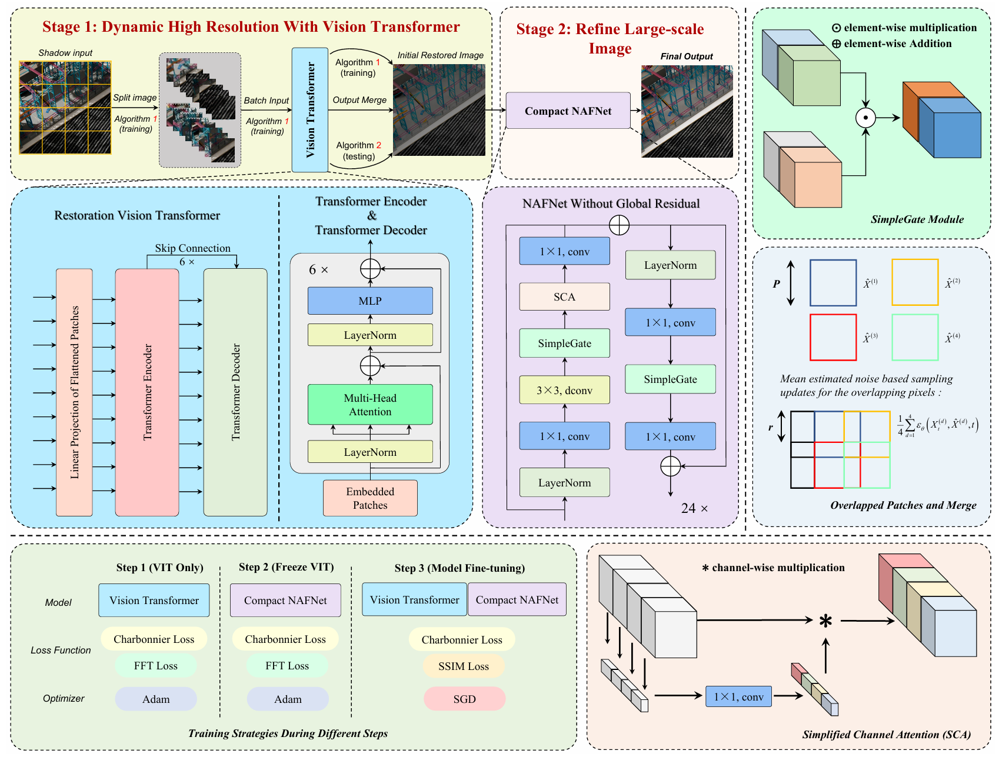

# HirFormer: Dynamic High Resolution Transformer for Large-Scale Image Shadow Removal

<a href='https://openaccess.thecvf.com/content/CVPR2024W/NTIRE/papers/Lu_HirFormer_Dynamic_High_Resolution_Transformer_for_Large-Scale_Image_Shadow_Removal_CVPRW_2024_paper.pdf'></a> &nbsp;&nbsp;

## :trophy: Winner solution of the CVPR 2024 Image Shadow Removal Challenge

Our team (LUMOS) wins the [New Trends in Image Restoration and Enhancement workshop and associated challenges in conjunction with CVPR 2024](https://cvlai.net/ntire/2024/NTIRE2024awards_certificates.pdf)!

This is the official PyTorch implementation of the paper:

>**HirFormer: Dynamic High Resolution Transformer for Large-Scale Image Shadow Removal**<br>
>Xin Lu, Yurui Zhu, Xi Wang, Dong Li, Jie Xiao, Yunpeng Zhang, Xueyang Fu<sup>&dagger;</sup>, Zheng-Jun Zha<br>
>University of Science and Technology of China (USTC)<br>
>CVPR Workshop 2024




## :wrench: Dependencies and Installation

```bash
git clone https://github.com/fanzh03/HirFormer.git
cd HirFormer
pip install -r requirements.txt
```

**Main dependencies:** PyTorch >= 1.10, torchvision, numpy, Pillow, tensorboard


## :file_folder: Project Structure

```
HirFormer/
    ├── ckpt/                    # Pre-trained checkpoints
    │   ├── best1.pth            # Stage 1: ViT model weights
    │   └── best2.pth            # Stage 2: NAFNet refinement weights
    ├── datasets/                # Dataset loading
    │   └── datasets_pairs.py
    ├── loss/                    # Loss functions
    │   ├── losses.py            # Charbonnier, FFT, SSIM losses
    │   ├── perceptual.py        # Perceptual loss
    │   ├── contrastive_loss.py
    │   └── ...
    ├── networks/                # Model architectures
    │   ├── MaeVit_arch.py       # Stage 1: Masked ViT encoder-decoder
    │   ├── NAFNet_arch.py       # Stage 2: NAFNet refinement network
    │   ├── Split_images.py      # Image splitting & merging (4x4 grid)
    │   ├── Patch_embed.py       # Patch embedding module
    │   └── ...
    ├── utils/
    │   ├── UTILS.py             # Metrics & utilities
    │   └── UTILS1.py
    ├── TEST.py                  # Inference script
    └── train_shadow_vit_wNAF.py # Training script
```


## :surfer: Quick Start

**Step 1: Download Checkpoints**

Download the pre-trained checkpoints and place them in the `ckpt/` directory:
- `best1.pth` — Stage 1 ViT model
- `best2.pth` — Stage 2 NAFNet refinement model

**Step 2: Run Testing**

```bash
python TEST.py \
    --eval_in_path ./test_images/ \
    --result_path ./results/
```

The shadow-free results will be saved in `./results/`. A log file at `./results/log_file/test.txt` records per-image PSNR/SSIM metrics.

**Note:** Ensure both paths end with `/`.


## :muscle: Train

**Step 1: Prepare Data**

Prepare training pairs (shadow / shadow-free images). We use the NTIRE 2024 and NTIRE 2023 shadow removal datasets.

**Step 2: Three-stage Training**

Our training follows a three-step strategy:

1. **Stage 1** — Train ViT with Charbonnier + FFT loss:
```bash
python train_shadow_vit_wNAF.py \
    --experiment_name stage1_vit \
    --unified_path ./experiments/ \
    --training_path_txt data/train_list.txt \
    --eval_in_path /PATH/shadow_val_input/ \
    --eval_gt_path /PATH/shadow_val_gt/ \
    --BATCH_SIZE 3 \
    --Crop_patches 1408 \
    --learning_rate 0.0004 \
    --EPOCH 600 \
    --base_loss char \
    --addition_loss fft
```

2. **Stage 2** — Freeze ViT, train NAFNet refinement:
```bash
python train_shadow_vit_wNAF.py \
    --experiment_name stage2_nafnet \
    --unified_path ./experiments/ \
    --load_pre_model True \
    --pre_model_0 ./experiments/stage1_vit/best_vit.pth \
    --BATCH_SIZE 1 \
    --Crop_patches 1408 \
    --learning_rate 0.0004
```

3. **Stage 3** — Fine-tune both stages jointly with Charbonnier + SSIM loss:
```bash
python train_shadow_vit_wNAF.py \
    --experiment_name stage3_finetune \
    --unified_path ./experiments/ \
    --load_pre_model True \
    --pre_model_0 ./experiments/stage1_vit/best_vit.pth \
    --pre_model_1 ./experiments/stage2_nafnet/best_nafnet.pth \
    --base_loss char \
    --addition_loss ssim \
    --optim sgd \
    --learning_rate 0.0002
```


## :book: Citation

If you find our repo useful for your research, please consider citing our paper:

```bibtex
@InProceedings{Lu_2024_CVPR,
    author    = {Lu, Xin and Zhu, Yurui and Wang, Xi and Li, Dong and Xiao, Jie and Zhang, Yunpeng and Fu, Xueyang and Zha, Zheng-Jun},
    title     = {HirFormer: Dynamic High Resolution Transformer for Large-Scale Image Shadow Removal},
    booktitle = {Proceedings of the IEEE/CVF Conference on Computer Vision and Pattern Recognition (CVPR) Workshops},
    month     = {June},
    year      = {2024},
    pages     = {6513-6523}
}
```


## :postbox: Contact

Please feel free to contact us if there is any question (luxion@mail.ustc.edu.cn).
